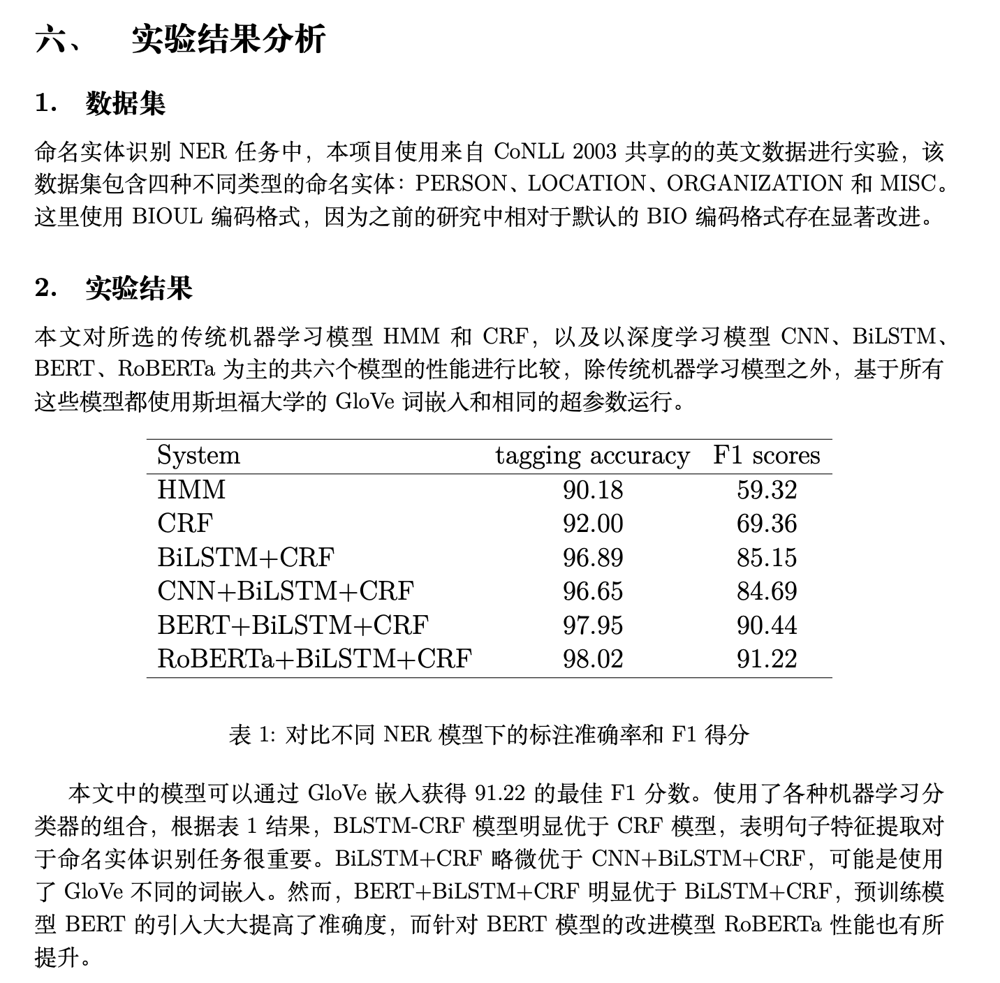

# CoNLL2003命名实体识别

## 目录结构和介绍

```text
.
├── allennlp-source-code # allennlp源码
├── configs # 模型配置文件
├── data # 数据集
├── models # 生成的模型目录，不包含大模型，只保存了训练日志和结果
│   ├── model_bert # BERT+BiLSTM+CRF
│   ├── model_bilstm_crf # BiLSTM+CRF
│   ├── model_cnn # CNN+BiLSTM+CRF
│   ├── model_crf # CRF only
│   ├── model_hmm # HMM only
│   └── model_roberta_crf # RoBERTa+BiLSTM+CRF
├─── ner_modules # 包含HMM和CRF tagger
│   ├── crf_tagger.py # CRF tagger
│   ├── hmm.py # 第一版HMM模型
│   └── hmm2.py # 第二版HMM模型
└── report # 项目报告
```

## 运行方式

1. clone到本地
    - `git clone https://github.com/HanielF/ner_with_allennlp.git`
2. 主要依赖环境介绍：
    - python= 3.7
    - pytorch== 1.8.1
    - allennlp== 2.4.0
    - allennlp-models==2.4.0
3. 切换到项目路径
    - `cd ner_with_allennlp`
4. HMM运行方式
    - `python ner_modules/hmm.py`
5. CRF/CNN/BiLSTM/BERT/RoBERTa运行方式
    - `python run.sh crf`
    - `python run.sh cnn`
    - `python run.sh bilstm_crf`
    - `python run.sh bert`
    - `python run.sh roberta_crf`

## 项目报告节选



